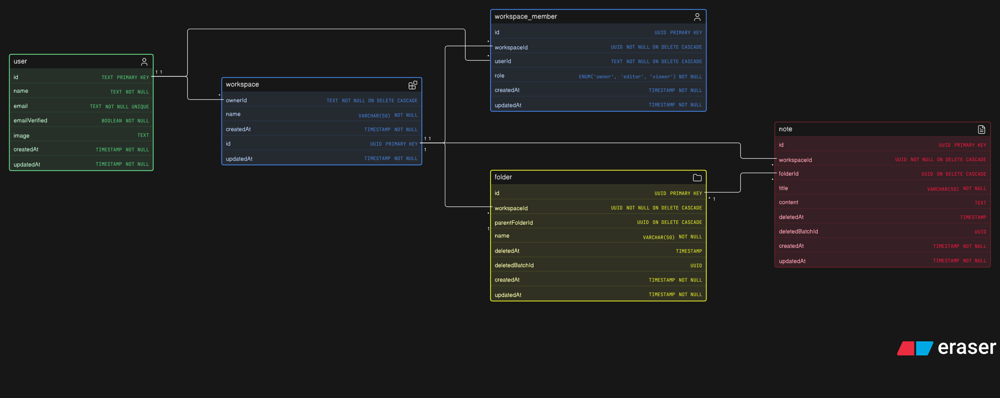

# Cognis — Phase 1

This describes the Phase 1 backend as it is built, not as it was planned. Everything here exists in `apps/api` unless a section says otherwise.

---

## Scope

**In:**

- Auth, via Better Auth
- Notes, organised into folders
- Everything scoped to a workspace
- Read-only sharing, by giving someone the `viewer` role on a workspace

**Out:**

- AI features — embeddings, note chunking, semantic search
- Custom ordering. Folders and notes sort alphabetically by name, and nothing stores a position.
- Sharing a single note or folder, or sharing by link. Access is granted per workspace and nothing narrower.

---

## Data model



### Tables

| Table                                        | Notes                                                                                                               |
| -------------------------------------------- | ------------------------------------------------------------------------------------------------------------------- |
| `user`, `session`, `account`, `verification` | Owned by Better Auth. We do not write to these.                                                                     |
| `workspace`                                  | Top-level container. Has `ownerId NOT NULL REFERENCES user.id`.                                                     |
| `workspace_member`                           | Joins a user to a workspace with a `role` of `owner`, `editor` or `viewer`. Unique on `(workspaceId, userId)`.      |
| `folder`                                     | Belongs to a workspace. Nests through a self-referencing `parentFolderId`.                                          |
| `note`                                       | Belongs to a workspace. `folderId` is nullable, so a note can sit at the workspace root. `content` is plain `TEXT`. |

Ids are UUIDs, except on the Better Auth tables, where `user.id` is `text` because Better Auth generates its own ids. Anything referencing `user.id` is therefore also `text`.

The diagram shows `user` only. `session`, `account` and `verification` are Better Auth's alone, are never written to by us, and are left out to keep it readable.

### Why a workspace has both `ownerId` and an owner role

The two look redundant. They answer different questions:

- **`workspace_member.role` decides general access.** Every folder and note query checks it, so authorisation needs no special cases.
- **`workspace.ownerId` decides owner-only actions** — deleting the workspace, managing members. It is checked directly rather than by looking up a role, because a single `NOT NULL` foreign key cannot drift out of sync the way a role value could.
- **`NOT NULL` also guarantees a workspace always has an owner.** A role-only design could lose its owner; this one cannot.

Creating a workspace inserts the `workspace` row and the owner's `workspace_member` row **in one transaction**, so the two can never disagree.

### Cascade wiring

Declared on the child table's foreign key:

- `folder.workspaceId` → `workspace.id`
- `folder.parentFolderId` → `folder.id`
- `note.workspaceId` → `workspace.id`
- `note.folderId` → `folder.id`
- `workspace_member.workspaceId` → `workspace.id`
- `workspace_member.userId` → `user.id`, so a deleted user's memberships clean themselves up
- `workspace.ownerId` → `user.id`, so deleting a user deletes the workspaces they own, and everything inside them

That last one is inert today, since deleting users is not a Phase 1 feature. It is the chosen behaviour for when it matters. The alternative, `RESTRICT`, would block deleting a user until their workspaces were handed over.

### Indexes

The rule used: index any column that appears in a `WHERE`, `JOIN ON` or `ORDER BY` on a table that will grow. Foreign keys especially — Postgres indexes primary keys automatically but not foreign keys.

| Table              | Index                          | Why                                                                                                              |
| ------------------ | ------------------------------ | ---------------------------------------------------------------------------------------------------------------- |
| `folder`           | `parentFolderId`               | List a folder's children                                                                                         |
| `folder`           | `(workspaceId, deletedAt)`     | Trash view. Also covers plain `workspaceId` lookups through the leftmost column, so no separate index is needed. |
| `folder`           | `deletedBatchId`               | Restore by batch                                                                                                 |
| `note`             | `folderId`                     | List a folder's notes                                                                                            |
| `note`             | `(workspaceId, deletedAt)`     | Same as the folder composite                                                                                     |
| `note`             | `deletedBatchId`               | Restore by batch                                                                                                 |
| `workspace_member` | `userId`                       | "Which workspaces am I in", for the workspace switcher                                                           |
| `workspace_member` | `(workspaceId, userId)` UNIQUE | The access check on nearly every request. The unique constraint already provides the index.                      |
| `user`             | `email` UNIQUE                 | Better Auth's login lookup. Constraint provides it.                                                              |
| `session`          | `token` UNIQUE                 | Session lookup on every authenticated request. Better Auth manages this.                                         |

`folder.name` and `note.title` are deliberately not indexed. Nothing searches or filters on them yet, and sorting alphabetically does not need an index at this size.

---

## Delete and restore

Folders and notes are soft deleted. Workspaces and memberships are not — removing those is immediate and permanent.

### Soft delete

Two columns do the work: `deletedAt` holds the time, `deletedBatchId` holds a UUID shared by everything deleted in the same action.

Deleting a folder also deletes everything inside it. A recursive CTE walks the folder's descendants — subfolders and notes — and stamps them all with the same `deletedAt` and `deletedBatchId`. This is done in application code rather than by the database, because `ON DELETE CASCADE` only fires on a real `DELETE`, and a soft delete is an `UPDATE`.

**The cascade only touches rows where `deletedAt IS NULL`.** This matters. If a note inside the folder had already been thrown away on its own, it carries its own batch id. Overwriting that would mean restoring the folder later also resurrects a note the user deliberately deleted separately.

### Restore

Restoring is always **batch-scoped**. It brings back every row carrying that `deletedBatchId`, and nothing else. It is never "everything currently under this folder", because that would sweep up items deleted at other times.

All three restore endpoints — folder, note, and trash batch — restore the whole batch. They therefore all run the same check across the whole batch, not just the row named in the URL.

**The check:** if any row in the batch has a parent folder that is trashed under a _different_ batch, the restore is refused with `409`. Restoring it would produce a row that is live but unreachable — missing from the tree because its parent is gone, and missing from the trash because it is not trashed. A parent inside the _same_ batch is fine, since it comes back in the same restore.

Checking only the row named in the URL is not enough. Restoring through a leaf would skip the batch root, and the root's parent is the one most likely to sit outside the batch.

### Hard delete

Only three things delete permanently:

1. **The purge job**, for folders and notes past the retention window. See [Operations](#operations).
2. **Removing a member.** Immediate, no trash step.
3. **Deleting a workspace.** Immediate, no trash step. One `DELETE FROM workspace` cascades through every folder at any depth, every note, and every membership.

There is no "delete forever" button. Keeping hard deletion to one path means one place to reason about when data actually disappears.

---

## Concurrency

Every operation that reads the folder tree and then writes to it does so under a **transaction-scoped Postgres advisory lock on the workspace**, with the read inside the lock. That is **creating** a folder or a note, **moving** either one, **soft deleting**, **restoring**, and the purge job. Each checks a condition that another one can invalidate before the write lands.

Two different things go wrong without it — a **cycle**, where two moves each pass their own check and commit, and an **orphan**, where the parent a row was checked against is trashed before the row lands.

**A title or content edit stays outside the lock.** It reads no tree structure, and autosave is by far the most frequent write here. Putting it on the workspace lock would serialise every keystroke against every move, delete and restore in that workspace.

### Why a lock, and why on the workspace

Row locks do not help. Two moves that would form a cycle — X under Y, and Y under X — write _different rows_ and never contend, so each passes its own check and both commit. The only thing they share is the workspace.

An advisory lock costs nothing when uncontended, blocks no readers, and releases on commit or rollback. `SERIALIZABLE` would also work, but it surfaces as an error the caller has to retry, and there is no retry machinery here.

### Orphaned rows

A create or a move checks that its target is live — the parent folder, or the folder a note is going into. Outside a lock, a soft delete landing between that check and the write leaves a live row under a trashed parent. It is missing from the tree because its parent is gone, missing from the trash because it was never deleted, and unrecoverable because restore works by batch and it belongs to none.

The delete cascade cannot catch it either. The cascade stamps everything currently inside the folder, and the new row does not exist yet when it runs.

Under the lock both orderings end somewhere valid. If the delete commits first, the create or move re-reads inside the lock, finds the target trashed, and returns `404`. If the create commits first, the delete's cascade sees the row and stamps it with the rest of the batch.

A folder or note created at the **workspace root** has no parent that could be trashed underneath it, so it skips the lock and inserts directly. The same goes for a move to the root.

### Folder cycles

A self-referencing foreign key guarantees the parent exists. It does not prevent a loop.

A cycle can only appear when a folder is **moved**. Creating a folder cannot cause one, since a new folder has no descendants — a create holds the lock for the orphan case above, not this one. So before a move commits, the same descendant walk used by the delete cascade runs, and the move is rejected if the new parent is the folder itself or any of its descendants.

This matters because a cycle would make every recursive query over that tree run forever. As a second line of defence the descendant CTE uses `UNION` rather than `UNION ALL` — identical results for a tree, where each node is reached once, but `UNION` stops on the duplicate if a cycle ever did exist, instead of spinning until the query is killed.

---

## API

### Conventions

- **All mutations go through REST.** The server then broadcasts the change over WebSocket to everyone else in that workspace. Clients never write over the socket.
- **Missing and forbidden look the same.** Asking for something in a workspace you are not a member of returns `404`, not `403`, so ids cannot be probed. `403` is only returned when you _are_ a member but your role is too low.
- **Errors share one shape:** `{ success, message }`, with a `429` also carrying `Retry-After`, and validation failures carrying an `errors` tree.
- **A malformed UUID in a path returns `400`.** Passing one to Postgres is a driver error rather than an empty result, so it is rejected before it reaches a query.
- **Request bodies are capped at 1mb**, above which the response is `413`. The default of 100kb is too small for a long note.
- **A request that loses a race reports the outcome, not a server fault.** A foreign key violation means a row the request referenced was deleted while it ran, and returns `404`, the same as any other missing row. A unique violation means someone inserted the same row first, and returns `409`. Every other constraint failure is our bug and stays `500`.

### Auth

`ALL /api/auth/*` is served by Better Auth's own handler — sign-up, sign-in, sign-out, session checks, password reset, email verification. None of it is hand-written, and its tables are the source of truth directly.

Our auth middleware runs Better Auth's session check on each request and puts the result on `req.user`.

Email verification is **required** before sign-in. Verification and password-reset mail is sent through Brevo.

### Workspaces

| Endpoint                          | Who        | Notes                                                                  |
| --------------------------------- | ---------- | ---------------------------------------------------------------------- |
| `POST /workspaces`                | any user   | Creator becomes owner. Sets `ownerId` and the membership row together. |
| `GET /workspaces`                 | any user   | Workspaces you belong to, each with your role                          |
| `GET /workspaces/:workspaceId`    | any member | Includes your role                                                     |
| `PATCH /workspaces/:workspaceId`  | owner      | Rename                                                                 |
| `DELETE /workspaces/:workspaceId` | owner      | Immediate and permanent. Cascade removes everything inside.            |

Owner-only actions check `workspace.ownerId`, not the member role.

### Workspace members

| Endpoint                                            | Who        | Notes                    |
| --------------------------------------------------- | ---------- | ------------------------ |
| `POST /workspaces/:workspaceId/members`             | owner      | Body is `email` + `role` |
| `GET /workspaces/:workspaceId/members`              | any member |                          |
| `PATCH /workspaces/:workspaceId/members/:memberId`  | owner      | Change role              |
| `DELETE /workspaces/:workspaceId/members/:memberId` | owner      | Immediate, no trash      |

**Members are added by email, never by user id.** The client is inviting a person, and it has no way to know a stranger's user id.

**The address is normalised before anything is done with it.** Better Auth lowercases every email it writes, so every stored `user.email` is lowercase. The invite schema normalises to that same form once, and both the user lookup and the rate-limit key are taken from the result — so an address typed with a capital letter still finds the person it belongs to, and is counted under the same key.

**Role is limited to `editor` or `viewer`.** Promoting someone to `owner` would be an ownership transfer, and Phase 1 has no endpoint for that.

**The owner cannot change or remove their own membership.** Either would leave the workspace without an owner.

**Adding a member sends them an email.** It is the only channel that reaches them — they have no socket in the workspace room and will not until their client joins. The mail is sent after the row is committed and is never awaited. A mail outage must not turn a completed add into a failed request, so a failure is logged and the user simply finds the workspace next time they open the app.

### Folders

| Endpoint                                | Who           | Notes                                                                                                                                       |
| --------------------------------------- | ------------- | ------------------------------------------------------------------------------------------------------------------------------------------- |
| `POST /workspaces/:workspaceId/folders` | owner, editor | `parentFolderId` optional; omit for the workspace root                                                                                      |
| `GET /workspaces/:workspaceId/folders`  | any member    | Optional `?parentFolderId=`. Pass a folder id for its children, or the literal `null` for root-level folders. Omit for the whole workspace. |
| `GET /folders/:folderId`                | any member    |                                                                                                                                             |
| `PATCH /folders/:folderId`              | owner, editor | Rename, move, or both. A move runs the cycle check.                                                                                         |
| `DELETE /folders/:folderId`             | owner, editor | Soft delete. Cascades to the subtree. Returns the `deletedBatchId`.                                                                         |
| `POST /folders/:folderId/restore`       | owner, editor | Restores the whole batch                                                                                                                    |

### Notes

| Endpoint                              | Who           | Notes                                             |
| ------------------------------------- | ------------- | ------------------------------------------------- |
| `POST /workspaces/:workspaceId/notes` | owner, editor | `folderId` optional; omit for the workspace root  |
| `GET /workspaces/:workspaceId/notes`  | any member    | Optional `?folderId=`, same convention as folders |
| `GET /notes/:noteId`                  | any member    |                                                   |
| `PATCH /notes/:noteId`                | owner, editor | Title, content, and/or move between folders       |
| `DELETE /notes/:noteId`               | owner, editor | Soft delete. Returns the `deletedBatchId`.        |
| `POST /notes/:noteId/restore`         | owner, editor | Restores the whole batch                          |

A note has no children, so deleting one is a single row. It still gets its own `deletedBatchId`, so the trash groups and restores it exactly like a folder subtree.

### Trash

| Endpoint                              | Who           | Notes                                                                |
| ------------------------------------- | ------------- | -------------------------------------------------------------------- |
| `GET /workspaces/:workspaceId/trash`  | any member    | Trashed folders and notes, grouped by `deletedBatchId`, newest first |
| `POST /trash/:deletedBatchId/restore` | owner, editor | Restores a whole batch                                               |

The restore path carries no workspace id, so the batch identifies its own workspace and the permission check follows from that. An unknown batch and a batch in a workspace you cannot reach both return `404`.

---

## Realtime

### Connection model

- One socket per client, authenticated the same way as REST, by reading the Better Auth session from the handshake cookie.
- A client joins a room per workspace, named `workspace:{workspaceId}`.
- **Membership is re-checked on the server at every join.** The room is the only thing gating what a socket receives, so it is never taken on the client's word. Viewers join like anyone else — they receive, they just never send.
- Clients send nothing except `workspace:join` and `workspace:leave`. Because there are no client-sent writes, no per-event permission check is needed beyond the join.

### Events

**Workspace**

| Event               | Payload                      |
| ------------------- | ---------------------------- |
| `workspace:updated` | the workspace row (a rename) |
| `workspace:deleted` | `{ id }`                     |

**Folders**

| Event             | Payload                         |
| ----------------- | ------------------------------- |
| `folder:created`  | the folder row                  |
| `folder:updated`  | the folder row (a rename)       |
| `folder:moved`    | `{ id, parentFolderId }`        |
| `folder:deleted`  | `{ id, deletedBatchId }`        |
| `folder:restored` | `{ deletedBatchId, folderIds }` |

**Notes**

| Event           | Payload                                                      |
| --------------- | ------------------------------------------------------------ |
| `note:created`  | the note row                                                 |
| `note:updated`  | `{ id, title, folderId, updatedAt }` — no content, see below |
| `note:moved`    | `{ id, folderId }`                                           |
| `note:deleted`  | `{ id, deletedBatchId }`                                     |
| `note:restored` | `{ deletedBatchId, noteIds }`                                |

**Members**

| Event                 | Payload            |
| --------------------- | ------------------ |
| `member:role_changed` | `{ userId, role }` |
| `member:removed`      | `{ userId }`       |

Member payloads carry ids rather than user records on purpose, so clients refetch the member list on either event.

### Why some events do not exist

**No `workspace:created`.** At creation the creator is the only member, so there is no room and nobody to tell.

**No `member:added`.** The people already in the room do not need it, and the one person who does care has no socket in that room yet. Telling them needs a per-user channel, which this connection model does not have, so they get an email instead.

### Design notes

**`note:updated` is throttled, and carries no content.** It is the one event autosave fires. Broadcasting a long note to every viewer on every save would flood them. It goes out at most once per second per note, leading edge and trailing edge, so a single edit is not delayed and the final state still arrives. Clients holding the note open refetch when they see it.

**A rename and a move are separate events.** Clients act on them differently: one patches a label, the other invalidates a subtree. A request that does both emits both.

**Moves and deletes do not list affected descendants.** Serialising a whole subtree into an event is more expensive than letting the client refetch it, so the payload names the row that changed and the client reloads what it needs.

**Losing access ends the subscription.** `member:removed` drops that user's sockets from the room, and `workspace:deleted` clears the room entirely. Both events are sent _before_ the eviction, because the event is the last thing that room will ever deliver.

**Events are emitted only after the transaction commits.** Broadcasting from inside one would announce a change that a rollback then erases, leaving every other client showing something that never happened.

**Concurrent edits are last-write-wins.** There is no CRDT and no operational transform. If two editors save the same note at nearly the same moment, the later write wins at the database level. The socket layer does not try to solve this.

---

## Rate limiting

Active in production only, and held in memory. Counts are therefore per process: two API instances would allow two instances' worth of traffic. That is a deliberate trade while there is one instance, and a shared store is the change to make when there is a second.

`/api/auth/*` is rate limited by Better Auth itself and is not configured by us. Its defaults already match everything else here — memory backed, production only — and it caps sign-in, sign-up, password reset requests and verification resends out of the box. The last two matter most: both send mail, so an uncapped endpoint can be aimed at someone else's inbox at our expense.

Everything else is limited per bucket. The numbers live together in `shared/config/rateLimit.ts`:

| Bucket                     | Keyed by          | Limit        |
| -------------------------- | ----------------- | ------------ |
| Flood guard, ahead of auth | IP                | 600 / min    |
| General API                | user              | 300 / min    |
| Note edits                 | user              | 120 / min    |
| Folder and note writes     | user + workspace  | 60 / min     |
| Member invite              | recipient address | 10 / hour    |
| Socket connections         | user              | 5 concurrent |
| `workspace:join`           | socket            | 20 / min     |

`/api/health` is exempt. It is registered ahead of the API router, so monitoring cannot trip the guard.

### Why three of these are keyed oddly

**Folder and note writes count against the user _and_ the workspace together.** Creates, moves, deletes and restores all serialise on the workspace advisory lock, so flooding them at one workspace stalls it for everyone in it. A per-user count alone would not stop that.

Restoring a trash batch spends from this bucket too, but from inside the handler rather than as middleware. The route carries no workspace id, so there is nothing to key on until the batch has named its own workspace, and the point is spent after the access check so the budget cannot be burnt through batches the caller cannot reach.

**Note edits get their own, looser bucket.** Autosave is legitimately chatty and should not spend the same allowance as structural writes.

**Invites are keyed by the recipient, not the sender.** The cap follows the inbox being written to, so adding and removing someone repeatedly cannot be used to fill it.

### The two limiters use different algorithms

**Ours is a fixed window.** The window opens on the first request and expires a fixed time later. This carries the usual boundary burst: spending the allowance at the end of one window and again at the start of the next allows up to twice the limit for an instant. Harmless for the volume buckets. Worth remembering for invites, where a burst across the boundary means twenty mails rather than ten.

**Better Auth's is not.** It re-anchors to the most recent allowed request, so the counter only resets after a full window of silence. Against its 3-per-10s sign-in limit, attempts at 0s, 4s and 8s leave the one at 12s blocked — which a fixed window would have allowed. That is stricter under sustained traffic, and the right behaviour for brute force, because pacing attempts just under the limit no longer farms attempts indefinitely.

---

## Operations

### Deploying behind a proxy — not optional

Both limiters key on the client's address. Behind any proxy, load balancer or CDN, the address a Node server sees is the proxy's, so **every request looks like it came from the same client.**

Left unconfigured:

- Our IP guard becomes a single 600-a-minute budget shared by everyone.
- Better Auth is worse. Unable to resolve a trusted address, it falls back to one shared bucket per path, making sign-in **3 attempts per 10 seconds for the entire user base**. Because its window only resets after a full window of silence, a moderately busy deployment would never be quiet long enough to reset it. **Sign-in would stop working**, and nothing about the symptom points at rate limiting.

The obvious fix is worse than the problem. Trusting the forwarded header outright hands the key to the caller: `X-Forwarded-For` is client-supplied, so an attacker gets a fresh bucket per request and bypasses the limit entirely — or pins the header to someone else's address and gets _that person_ throttled.

What is needed is a narrow value: either the number of proxy hops in front of the app, or the specific proxy addresses. It has to be set in **both** places, because the two resolve the address independently:

- Express, for our limiters — `app.set("trust proxy", <hops or CIDR>)`
- Better Auth, for its own — `advanced.ipAddress.ipAddressHeaders` / `trustedProxies`

Configure one and not the other and one limiter works while the other does not.

Neither is set today, because the right value depends on a deployment topology that has not been chosen. Better Auth logs a warning the first time it cannot resolve an address — that is the signal to watch for on the first deploy.

### The purge job

Folders and notes past `TRASH_RETENTION_DAYS` (default 30) are deleted permanently by a scheduled job. **Nothing starts it for you.** `pnpm start` runs the server and only the server, so on a fresh deploy the trash grows forever until something external runs the job.

That is the cost of keeping it out of the API process, and it is deliberate: a timer inside the server fires once per instance, so two instances would run concurrent purges over the same rows.

It is a plain one-shot process that exits `0` on success and `1` on failure, so anything that can run a command on a schedule will do. On a single box, cron:

```
0 3 * * * cd /path/to/cognis/apps/api && /absolute/path/to/node dist/jobs/purgeTrash.js >> /var/log/cognis-purge.log 2>&1
```

Three things silently break that line:

- **Use an absolute path to node.** Cron's `PATH` is minimal, and a version manager (mise, nvm, asdf) puts node somewhere it will not look. `which node` gives the path.
- **Keep the `cd`.** The job reads `.env` through `dotenv/config`, which resolves against the working directory. Without it `DATABASE_URL` is missing and the job exits 1 before doing anything.
- **Build first.** `dist/jobs/purgeTrash.js` only exists after `pnpm build`. Before that, use `pnpm purge:dev`, which runs the source through tsx.

On a container platform use its own scheduler — a Kubernetes `CronJob`, a Railway or Render cron service, a scheduled Fly machine — running the same command.

Send the output somewhere you will actually read. A skipped folder is reported on stdout, and that is the only signal that something in the trash is stuck.

**Why the job cannot simply delete every expired folder.** Deleting a folder cascades to its whole subtree, expired or not. Today a row can only be trashed at or before its parent, so an expired folder's subtree is always expired too — but that holds because of how restore behaves, not because anything enforces it. Since this is the only irreversible operation in the system, the job checks each expired folder's subtree first, and skips and reports any that still holds a live or recently trashed row. It purges on a later run once the rest expires.

---

## Open questions

- The workspace invite email links to `CLIENT_URL` rather than straight to the workspace, because no frontend routes exist yet to link into. Worth replacing with a deep link once they do.
