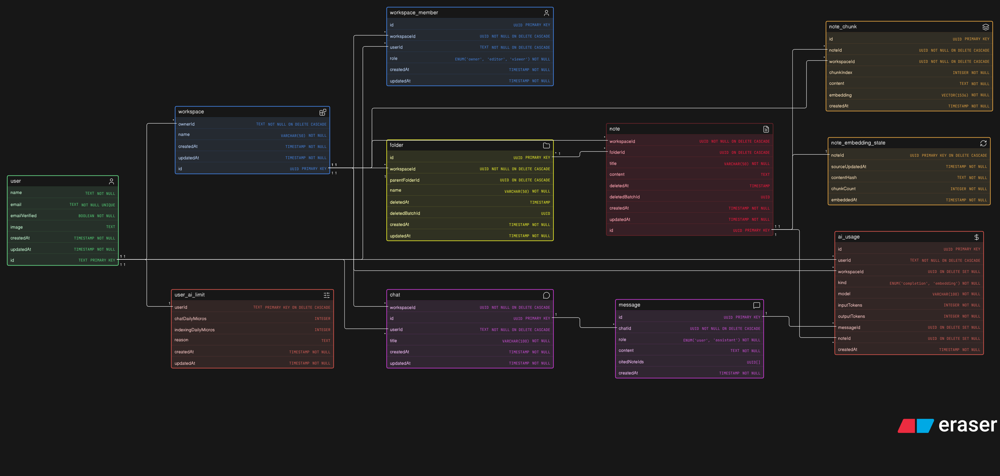

# Cognis — Phase 2

**Chat with your notes.** Inside a workspace, ask an AI questions and get answers grounded in the notes that live there.

Unlike the Phase 1 document, this one describes what is _planned_, not what is built. It will be rewritten to match reality once the work lands, the way the Phase 1 doc was.

---

## Scope

**In:**

- Multiple chats per workspace, created and managed like threads in ChatGPT or the Claude app
- Answers grounded in that workspace's notes, with citations back to the notes used
- Streaming responses, so text appears as it is generated
- Hard spend limits, per user and across the whole app, because every message costs real money

**Out:**

- Editing notes from a chat. The AI reads; it does not write.
- Chats that span more than one workspace. A chat belongs to exactly one.
- Shared or collaborative chats. Yours are yours alone.
- Uploading files. Only notes are searchable.
- Tool calling or agentic behaviour. The model cannot fetch anything itself; it answers from what it is given.

---

## The feature in plain terms

You open a workspace, start a chat, and type a question. The server finds the parts of your notes most likely to answer it, hands those to the model along with your question, and streams the answer back. The answer says which notes it drew on.

Each chat remembers its own history, so follow-up questions work. Chats are listed newest-first, titled from your first message.

---

## Technology choices

### The model

`gpt-5.6-luna`, at **$0.20 per million input tokens** and **$1.20 per million output tokens**, with a 1.05M token context window and streaming support.

Both model ids are plain constants, declared together in one config module beside the price table and the spend limits. Neither is an environment variable: the embedding model cannot be one, because its output dimension is fixed in the `note_chunk` column type and changing it means a migration plus a full re-embed. Keeping the chat model next to it means the two are read, reviewed and changed in the same place, and a swap is one line in a file that is version-controlled rather than a value that can differ per environment without anyone noticing.

### Embeddings, and why they live in Postgres

To find "the parts of your notes most likely to answer this", every note is converted into vectors — lists of numbers that capture meaning, so that text about the same idea lands near text about that idea even when the words differ. Finding relevant notes then means finding the nearest vectors.

Those vectors are stored in **Postgres, using the `pgvector` extension**, rather than a dedicated vector database like Qdrant.

The deciding reason is Phase 1's trash design. **A note's searchability changes without its content changing** — soft delete, restore, batch restore, purge. In Postgres that is a single condition on a query:

```sql
WHERE chunk.workspace_id = $1 AND note.deleted_at IS NULL
ORDER BY chunk.embedding <=> $2
```

The vectors never move. Trashing a note hides it from search instantly; restoring it brings it back; neither writes a single vector.

With an external vector database, every one of those becomes a **second write to a separate system that can fail on its own**. Trash a folder holding forty notes and that is forty updates to keep in sync. If one fails, the two stores disagree — search returns notes the user deleted, or misses notes they restored. That is the same class of bug the Phase 1 concurrency work spent its time eliminating, and it is not worth reintroducing as an architecture.

Beyond that: one less service to run, secure and back up; and the workspace filter becomes a plain `WHERE` clause rather than something you must remember to pass.

**The honest trade-off.** `pgvector`'s index can return fewer results than asked for when a filter is very selective, because it walks the index and discards rows that do not match. If one workspace is a tiny slice of all vectors, recall suffers. The image ships **pgvector 0.8.6**, which has iterative index scans for exactly this case, so the tool is there if workspace-filtered recall ever proves short. Nothing is tuned yet — there is no data to tune against.

Revisit this decision if a single workspace ever passes roughly a million chunks. Nothing is close.

### No LangChain

The whole pipeline is: split text, call an embeddings endpoint, run a nearest-neighbour query, build a string, stream a completion. Each of those is a handful of lines against tools already in use.

A framework would wrap them in generic abstractions and add a large dependency tree for no gain — and, more importantly, it would hide the workspace filter inside a generic search interface. That one condition is the most security-critical line in the feature, and it should be visible in plain SQL, not buried in configuration.

One good idea is worth borrowing without the dependency: **recursive splitting** — break text on paragraph boundaries first, fall back to sentences, then hard-wrap. About forty lines.

### The plain OpenAI SDK, not the Agents SDK

`openai` is the standard client. `@openai/agents` is a framework for agent loops — tool calling, handoffs, guardrails.

Phase 2 makes one completion call with pre-assembled context and no tools. An agent framework around a single turn is the same over-abstraction as a chain framework, with the added cost of being pre-1.0 and still changing.

If a later phase lets the model search or create notes on its own, the Agents SDK becomes the right tool. Not yet.

### Streaming over the existing socket

The client sends its message over REST and receives the answer token by token over Socket.IO.

This keeps Phase 1's rule intact — **clients never write over the socket** — while adding the per-user channel that Phase 1 noted was missing. Server-Sent Events would be a tidier fit over HTTP, but React Native has no built-in `EventSource` and its `fetch` does not reliably stream, so it would mean an extra client library. Socket.IO already works there.

**The stream is a convenience, not the source of truth.** The assistant's message is saved server-side when generation finishes, whether or not anyone is listening. A dropped connection mid-answer means the client reloads the chat and finds the complete message waiting.

---

## Data model



### New tables

| Table                  | What it holds                                                                           |
| ---------------------- | --------------------------------------------------------------------------------------- |
| `chat`                 | One conversation. Belongs to a workspace, owned by one user.                            |
| `message`              | One turn. `role` is `user` or `assistant`. Assistant turns record the notes they cited. |
| `note_chunk`           | A slice of a note plus its embedding.                                                   |
| `note_embedding_state` | How far a note's embeddings have caught up with its content.                            |
| `ai_usage`             | One row per paid API call. The billing ledger.                                          |
| `user_ai_limit`        | Per-user spend overrides. No row means the defaults apply.                              |

The diagram is cumulative — it shows Phase 1's tables alongside Phase 2's, because the new ones only make sense against the old.

Ids follow Phase 1's convention: UUID throughout, except references to `user.id`, which are `TEXT` because Better Auth generates its own ids. That makes `chat.userId`, `ai_usage.userId` and `user_ai_limit.userId` all `TEXT`.

### Three decisions worth explaining

**Chunks survive a soft delete.** `ON DELETE CASCADE` only fires on a real `DELETE`, and trashing a note is an `UPDATE`. So a trashed note keeps its chunks, and search simply skips them by checking `note.deletedAt`. Restoring is then free — no re-embedding, no API cost. When the purge job eventually hard-deletes the note, the cascade removes the chunks for real. This mirrors exactly how the trash already works.

**Embedding state is a separate table, not columns on `note`.** `note.updatedAt` updates itself on every write to the row. Putting an `embeddedAt` column on `note` would mean that recording "this note is now embedded" bumps `updatedAt`, which immediately makes the note look stale again — an endless re-embedding loop, burning money on every pass. A separate table keeps the note row untouched. Staleness becomes a clean comparison: `note.updatedAt > state.sourceUpdatedAt`, or no state row at all.

**The usage ledger does not cascade.** `ai_usage` points at a message and a note with `ON DELETE SET NULL` rather than `CASCADE`. Deleting a chat must not erase the record of what it cost. The ledger also stores **raw token counts, never money**, so a price change leaves history intact — cost is calculated from a price table at read time.

---

## How a note becomes searchable

### Splitting

A note is split into chunks of roughly 800 tokens with a small overlap, breaking on paragraph boundaries where possible. Short notes become a single chunk.

Each chunk has the note's **title prepended before embedding**. A chunk reading "we decided to use an advisory lock" is far easier to find when the vector also carries "Concurrency notes".

Because the title is part of what gets embedded, the freshness hash below covers **title and content together**. Hashing content alone would let a rename slip through, leaving every chunk carrying the old title.

### Embedding

Chunks go to `text-embedding-3-small` (1536 dimensions, **$0.02 per million tokens**) in batches. The dimension is fixed in the column type, so changing embedding model later means a migration and a full re-embed.

### Keeping up with edits

This is the hard part, because **autosave writes constantly** — the note edit limit is 120 per minute per user, precisely because autosave is chatty. Embedding on every save would be absurd.

Three mechanisms, in order of defence:

**Indexing is charged to the workspace owner**, not to whoever typed. The owner is derivable from the note alone, which is what the background worker sees, and the content is theirs. The alternative — charging the editor — cannot work from the worker, which has no idea who last wrote the note.

**1. Content hashing.** Before doing anything, hash the note's content and compare it to the stored hash. If they match, just record that it is up to date and stop — no splitting, no API call, no cost. Many autosaves do not change content meaningfully: an undo back to the original, a cursor move, a save fired on a pause where nothing was typed. This makes all of those free.

**2. A debounce.** When a note is written, schedule an embed for a few seconds later, resetting the timer on each new write. Embedding happens once typing stops, not once per keystroke. This is what makes a note you just wrote available to chat almost immediately.

Note this is a _debounce_, not the throttle already in `realtime/throttle.ts`. That one fires immediately and again at the end of the window, which is right for broadcasting `note:updated`. Embedding wants the opposite — wait for quiet, then act once. They live side by side.

**A floor interval sits underneath it.** The debounce handles the typical case, but it only reacts to how someone types — a writer who pauses to think every ten seconds triggers an embed on every pause. So a note is additionally never embedded more than **once per 60 seconds**, whatever happens.

It behaves as a cooldown. If the debounce wants to fire and the note was embedded 20 seconds ago, it waits out the remaining 40 rather than running. Nothing is dropped — the pending work merges into the next permitted run, which embeds whatever the newest content is by then. One note therefore costs at most 60 embeds an hour, regardless of typing pattern. The debounce covers the common case; the floor bounds the worst one.

**3. A worker process.** A separate entrypoint, alongside `jobs/purgeTrash.ts`, that polls for stale notes and embeds them. This is the backstop: the debounce lives in memory, so a restart loses it, and a second API instance would not see the first one's timers.

Mutual exclusion comes from the embed itself, not from how the worker picks notes. Embedding one note runs in a transaction with `SELECT ... FOR UPDATE` on that note's row, so two processes can never embed the same note at once. The selection query deliberately takes no lock: a row lock lives only as long as its transaction, and holding one open across a whole batch would serialise the very calls it is meant to spread out. Two workers may therefore select the same note, and the second simply waits, finds the hash already current, and returns "unchanged" for the price of one read.

Holding that transaction across the embedding API call does mean holding a database connection for the length of a network round trip. That is a deliberate trade — it buys exact exclusion for a worker doing serial batches, where pool pressure is nil — and the thing to revisit if embedding throughput ever matters.

**Backfill comes free.** Notes written before Phase 2 have no state row, which makes them stale by definition. The worker picks them up on its first run. No separate migration script.

**A ceiling per note.** Above a certain content length, only the first N chunks are embedded. A pasted book should not quietly cost a fortune.

---

## How a question becomes an answer

1. Check the user is a member of the workspace, and owns the chat.
2. Check they have budget left.
3. Embed the question.
4. Gather context.
5. Call the model, streaming tokens out as they arrive.
6. Save both messages, and record what it cost.

### Gathering context

Two strategies, chosen by size:

**If the workspace's notes are small — under about 6,000 tokens — send all of them.** No search, no ranking, no chance of retrieving the wrong thing. The model sees everything and answers accordingly.

**Otherwise, retrieve.** Embed the question, find the nearest chunks, send those.

A 1.05M context window means almost any workspace would _fit_. That is not the constraint — **cost is**. Sending 15,000 tokens of context costs roughly three times what a focused retrieval costs, on every single message. The threshold is set by budget, not by capacity, which is why 6,000 and not a million.

### The note index

**Every request includes a list of the workspace's live notes** — id, title, last updated — regardless of which strategy is used.

This is cheap, since titles are capped at 50 characters, and it fixes the most annoying failure of pure search: being told "I don't see anything about that" when a note plainly exists but did not rank highly. With the index present, the model can say "you have a note called _Deployment checklist_, shall I look at it?"

For very large workspaces the index is capped at the most recently updated notes.

### Follow-up questions

A short reply carries no meaning on its own. Embedding "yes" and searching for it returns effectively random chunks, so a note the assistant just offered to read is no more likely to come back than before. The same goes for "tell me more", "why?" and "the second one".

That matters most for a specific exchange this design invites. The note index lets the assistant say _"you have a note called Deployment checklist, shall I read it?"_ — and without a fix, saying yes retrieves nothing useful and the assistant either repeats itself or invents an answer.

So before searching, a small model call rewrites the latest message into a standalone query using the recent turns:

```
"what did I write about deployment?"
"...you have a note called Deployment checklist, want me to read it?"
"yes"                    →  "Deployment checklist"
```

Measured against a test corpus, that moves the offered note from distance 0.817 to 0.422 — from unranked to first by a clear margin.

**It only runs where it can help**, which keeps it close to free:

- **Only with history.** The first message of a chat already stands alone.
- **Only when searching.** On the inline path every note is already in context, so nothing a better query could improve.

Since a workspace stays on the inline path until it passes 6,000 tokens, this will rarely fire for some time. It needs to exist for when it does.

**The cheap alternative was rejected deliberately.** Embedding the previous turn glued to the current one needs no model call and would fix "yes" — but it breaks on a change of subject, where the old topic then pollutes the query. That makes retrieval worse on the common path to fix the uncommon one. A model reading _"actually, forget that — what about sourdough?"_ gets it right.

**A failed rewrite is never fatal.** If the call errors, or returns something implausible, the raw question is searched instead. That is simply the behaviour without this step: degraded retrieval, not a broken chat.

The proper long-term answer is letting the model retrieve for itself through tool calls, which subsumes rewriting entirely — it writes its own queries and can read a named note on request. That is a later phase; per message it means several model round trips instead of one, which roughly doubles to triples the cost.

### The system prompt differs by strategy

The two paths can honestly promise different things, and one instruction for both makes the model offer what the plumbing cannot deliver.

On the **inline** path it holds every note in full, so offering to "look at" one is nonsense — it already has. On the **retrieved** path it holds excerpts plus the index, so offering is right, and the rewrite above is what makes the offer keepable.

### Prompt order matters for cost

OpenAI charges less for input it has seen before, but only when the _beginning_ of the prompt matches. So the prompt is built stable-first:

```
[ system prompt ][ note index ]            ← changes rarely, cacheable
[ retrieved chunks ][ history ][ question ] ← changes every message
```

Putting the question first, or mixing the stable and variable parts together, means nothing matches and the discount is lost. It costs nothing to build it in this order from the start and is irritating to retrofit. The exact caching rules get verified against the SDK before this is relied upon.

This is also why the two strategies place their notes differently. **Inlined notes go in the system message**, because on that path the content is the same every turn and belongs in the cacheable prefix. **Retrieved chunks go with the question**, because they change with every question and would destroy the prefix if placed any earlier. History sits between the two, which keeps the prefix stable as a chat grows — earlier turns never change — until the conversation is long enough that trimming starts dropping its oldest turns.

**Embedding the question is recorded but not gated.** It is an embedding call made during a chat, so it lands in the ledger under `embedding` and counts toward the indexing budget. It is deliberately not _checked_ against it: a question costs well under a micro-dollar, and refusing to chat because a day of heavy writing exhausted the indexing allowance would be a baffling way to fail. What gates a chat is the chat budget and the global ceiling.

### The line that must never be wrong

Search is filtered to one workspace. If that filter is ever missing, **another workspace's notes end up in someone's answer and nothing errors** — the model simply, quietly knows things it should not.

So retrieval lives in a single function that carries the workspace condition, and nothing queries `note_chunk` directly. This is the same shape as `assertWorkspaceRole` in Phase 1: one chokepoint, impossible to forget.

### Citations

An assistant message stores the ids of notes its answer drew on, so the client can link to them. The ids are a plain array rather than foreign keys, because a cited note may later be deleted and the message should survive that. Clients handle a missing note gracefully.

---

## API

| Endpoint                              | Who              | Notes                                      |
| ------------------------------------- | ---------------- | ------------------------------------------ |
| `POST /workspaces/:workspaceId/chats` | any member       | Creates a chat                             |
| `GET /workspaces/:workspaceId/chats`  | any member       | Your chats in this workspace, newest first |
| `GET /chats/:chatId`                  | the chat's owner | Chat plus its messages                     |
| `DELETE /chats/:chatId`               | the chat's owner | Immediate and permanent                    |
| `POST /chats/:chatId/messages`        | the chat's owner | Sends a question, triggers the model       |
| `GET /me/ai-usage`                    | any user         | Spend used, limits, when the window rolls  |

**Viewers can chat.** Chatting is reading, and a viewer can already read every note in the workspace. Nothing is exposed that they could not open directly.

**Ownership is checked alongside membership, not instead of it.** A chat is private to its creator, but access also re-checks workspace membership on every request. Someone removed from a workspace loses access to the chats they made there — the chat rows remain, but are unreachable. Only deleting the workspace or the user removes them.

**A missing chat and someone else's chat look identical.** Both return `404`, consistent with Phase 1's rule that ids should not be probeable.

---

## Realtime

Clients join a room per chat, the same shape as `workspace:join` and with the same server-side check — you may only join a chat you own.

**Client sends:** `chat:join`, `chat:leave`. Nothing else, as before.

**Server sends:**

| Event                    | Payload                                        |
| ------------------------ | ---------------------------------------------- |
| `chat:message_started`   | `{ chatId, messageId }`                        |
| `chat:token`             | `{ chatId, messageId, delta }`                 |
| `chat:message_completed` | `{ chatId, messageId, content, citedNoteIds }` |
| `chat:error`             | `{ chatId, messageId, message }`               |

Joining by chat rather than by user means several devices open on the same conversation all follow the stream, while chats you are not looking at cost nothing.

---

## Cost

This is the constraint that shapes the feature. The OpenAI balance is small and deliberately not being topped up often.

### What a message actually costs

| Shape                                   | Input | Output | Cost        |
| --------------------------------------- | ----- | ------ | ----------- |
| Light — short question, tight retrieval | 1.5k  | 300    | **$0.0007** |
| Typical — retrieval path                | 3k    | 500    | **$0.0012** |
| Heavy — whole workspace inlined         | 15k   | 800    | **$0.0040** |

Two things follow.

**Output is the expensive half.** At $1.20 against $0.20, one output token costs as much as six input tokens. At typical shape, 500 tokens of answer cost the same as 3,000 tokens of context. **Capping answer length is the strongest cost lever available** — stronger than trimming what gets retrieved.

**Inlining the whole workspace costs roughly three times a retrieval.** Hence the 6,000-token threshold.

### Limits

Because input and output differ six-fold in price, a single "token budget" would be misleading. **Limits are denominated in money**, stored as micro-dollars — millionths of a dollar, as integers, so there is no floating-point drift. One typical message is about 1,200 of them.

| Tier                         | Chat / day | ≈ typical messages | Indexing / day | Total / day |
| ---------------------------- | ---------- | ------------------ | -------------- | ----------- |
| **Default** — any new signup | $0.010     | ~8                 | $0.005         | $0.015      |
| **Friend** — granted by hand | $0.050     | ~40                | $0.010         | $0.060      |
| **Owner**                    | $0.150     | ~125               | $0.030         | $0.180      |

Message counts assume typical shape; a run of long answers gets fewer, short questions get more.

A `user_ai_limit` row overrides these defaults, and each column is independently optional — setting only the chat budget leaves indexing on its default, and vice versa. No row at all means both defaults apply.

**Chat and indexing have separate budgets.** They are different behaviours, and importing a lot of notes on a Tuesday should not cost you the ability to ask questions about them. The indexing allowance is deliberately generous against its real cost — $0.005 buys around 250,000 embedding tokens, roughly 500 average notes in a day. It exists to stop a runaway, not to ration normal writing.

### Why writing a note does not drain the indexing budget

Embedding one note is trivially cheap. The danger is the multiplier: cost scales as **note size × number of saves**, and autosave makes the second number large.

Re-embedding a whole note on every autosave — a ten-minute session, saving every three seconds, so 200 saves:

| Note size     | Tokens embedded | Cost for one session |
| ------------- | --------------- | -------------------- |
| 500 tokens    | 50k             | $0.001               |
| 2,000 tokens  | 300k            | **$0.006**           |
| 10,000 tokens | 1.8M            | **$0.036**           |
| 50,000 tokens | 9.6M            | **$0.192**           |

Against a $0.005 daily allowance, **one ten-minute session on a merely long note would exhaust the entire day's indexing budget** — and the user would hit the cap mid-sentence, with their notes quietly ceasing to be indexed for the rest of the day.

This is what the debounce and the floor interval are really for. Together they reduce that session to at most ten embeds, keeping a long note's editing cost in the fractions of a cent where it belongs.

It also corrects an easy misreading of the three mechanisms: hashing is **not** what saves money while someone is typing. During active editing the content genuinely differs on every save, so the hash differs too and every save would be paid for. Hashing defends against writes that do not change the text at all — moves, restores, an undo back to the original. The debounce and the floor defend against the intermediate states of writing. Different waste, different guard.

**If large notes turn out to be common**, the next lever is chunk-level hashing: hash each chunk and re-embed only the ones that changed. Appending to the end of a note then costs one chunk rather than all of them. The complication is that inserting text near the beginning shifts every later chunk boundary, so everything re-embeds regardless unless boundaries are content-defined — which is real work. Left undone deliberately; the `ai_usage` ledger records embedding calls per note, so the decision can be made from evidence rather than guesswork.

On a $3.37 balance, the owner tier at _full_ daily saturation lasts about 18 days. Real usage is nowhere near saturation, so expect considerably longer.

### The cap that actually protects the balance

Per-user limits do not bound total exposure — ten users is ten times the spend. So there is also a **global daily ceiling across all users**, starting at **$0.50 per day**.

That guarantees the balance survives at least a week no matter what happens: a rush of signups, a retry loop, deliberate abuse. When it trips, everyone sees a clear "AI is temporarily unavailable" instead of the account silently draining.

A hard spend cap is also set in the OpenAI dashboard. Our own accounting will have a bug eventually; theirs does not depend on our code being right.

### Metering

Every paid call writes a row to `ai_usage` holding raw token counts. Current spend is a sum over that ledger.

**The window rolls, it does not reset.** Spend is measured over the previous 24 hours rather than resetting at midnight. A fixed window lets someone spend the whole allowance just before the boundary and again just after — double the intended amount in a few minutes. The Phase 1 document works through the same problem for request rate limits. Over a ledger, a rolling window costs nothing extra.

**A ledger rather than a counter** because pricing is coming, and plans will need per-call detail: what was spent, on which model, for which message. It also makes the window trivial to change.

### Authorising a call you cannot price in advance

Token usage is only known _after_ a request completes, so exact pre-authorisation is impossible. The goal is to **bound the overshoot**, not to pretend it away:

1. **Before** — refuse outright if the rolling total already meets the limit.
2. **Bound** — set the maximum answer length to whatever budget remains, so the worst case is capped by what is left rather than being open-ended.
3. **After** — record what was actually used, from the response.

A user can therefore finish slightly over their limit on their final message. That is accepted deliberately. The alternative — charging an estimate up front and reconciling afterwards — is more machinery than this warrants.

**Refusing well matters too.** A rolling window has no reset time, so "try again tomorrow" would be wrong. The `Retry-After` on a refusal is when that caller's _oldest_ charge ages out of the window, which is the moment some allowance genuinely returns — sooner than a full window for anyone who spent gradually.

The two ceilings also fail differently on purpose. A personal allowance is the caller's own to wait out. The global one is not their fault and should not read as though it were, so it says AI features are temporarily unavailable rather than blaming them for a limit they may have contributed nothing to.

Guards run cheapest-first: prove the chat belongs to the caller, then that the traffic is reasonable, then that there is budget. Nothing is written for a request that could not have been answered — a refused message leaves no trace in the conversation.

**One trap:** streamed responses do not report usage by default. The request must explicitly ask for it, or the final chunk arrives without token counts and spending is silently recorded as zero. This gets verified against the installed SDK rather than assumed.

---

## Rate limiting

Chat adds the first endpoint that costs money per request, so it gets its own bucket alongside the existing ones in `shared/config/rateLimit.ts`:

| Bucket        | Keyed by | Limit    |
| ------------- | -------- | -------- |
| Chat messages | user     | 20 / min |
| `chat:join`   | socket   | 20 / min |

Rate limits and spend limits do different jobs and both are needed. The rate limit stops a burst hammering the API; the spend limit stops slow, steady, expensive use. Neither substitutes for the other.

---

## Operations

### The database image changes

The stock `postgres:17` image does **not** include `pgvector`:

```
SELECT name FROM pg_available_extensions WHERE name LIKE '%vector%';   →  0 rows
```

`docker-compose.yml` moves to `pgvector/pgvector:pg17`, which is the same Postgres major version with the extension added. Existing data in the volume survives, but the container needs recreating:

```
docker compose up -d --force-recreate
```

**`drizzle-kit` does not emit `CREATE EXTENSION`.** It generates the `vector(1536)` column happily and the migration then fails on any database where the extension is not already enabled. `CREATE EXTENSION IF NOT EXISTS vector;` is prepended to the migration by hand so it is self-contained — worth remembering if a later migration adds another extension.

### New environment variables

```
OPENAI_API_KEY=sk-...
```

Only the secret. Model ids are constants in config, not environment variables — see [The model](#the-model).

### A second background process

Phase 1 introduced one scheduled job, the trash purge. Phase 2 adds the embedding worker. **Nothing starts either one for you.** `pnpm start` runs the server and only the server.

Unlike the purge job, the embedding worker is not a one-shot run on a timer — it is a long-running loop that polls for stale notes. On a container platform it is a second always-on service. Running more than one is safe — the per-note row lock and the content hash between them make a duplicate attempt free — but it adds contention rather than throughput. Run one.

If the worker is not running, notes still get embedded by the in-process debounce under normal conditions. What is lost is the recovery path: anything missed during a restart stays unsearchable until the worker runs. Do not treat it as optional.

### Granting someone a higher limit

A one-shot entrypoint, in the style of the purge job:

```
pnpm ai:limit someone@example.com --chat 150000 --indexing 30000
```

It writes a `user_ai_limit` row, validating that the user exists first, so raising your own limit does not mean hand-writing SQL.

---

## Build order

Each step is reviewed before the next begins.

| Step    | What lands                                                                 |
| ------- | -------------------------------------------------------------------------- |
| **2.1** | `pgvector` image, extension, all six tables, HNSW index. No behaviour.     |
| **2.2** | Splitting, embedding, content hashing, the debounce, the worker, backfill. |
| **2.3** | Retrieval, the note index, context assembly, follow-up rewriting.          |
| **2.4** | Chat and message endpoints, ownership rules, spend ledger and limits.      |
| **2.5** | The model call, streaming over the socket, citations, usage recording.     |

Steps 2.1 through 2.4 cost nothing to run beyond embeddings. The first real spending starts at 2.5.

---

## Open questions

- **Conversation history has no long-term answer yet.** It is capped at the last few turns within a token budget. A long chat eventually forgets its own beginning. Summarising older turns is the usual fix and costs another model call; deferred until the shape of real conversations is visible.
- **Nothing re-ranks retrieved chunks.** Nearest-neighbour order is used as-is. A re-ranking pass improves quality and costs latency and money. Worth revisiting once answers can be judged against real notes.
- **Search is meaning-only.** An exact term that happens to embed poorly — an error code, an unusual name — may not surface. Postgres full-text search could be combined with the vector search to cover this. Deferred, as it doubles the query's complexity.
- **The in-process debounce is per-instance.** With two API instances, an edit on one is not debounced on the other; the worker covers the gap, but a note could take until the next poll to become searchable. Fine at one instance, worth revisiting at two.
