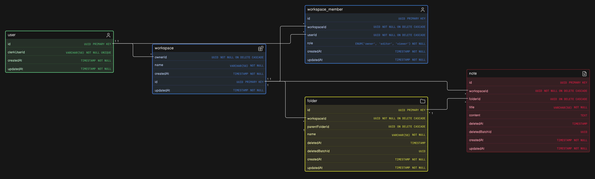

# Cognis - Phase 1 PRD

## Scope

Phase 1 covers:

- Auth (Clerk)
- Notes management via folders and notes
- Everything scoped under workspaces
- Read-only sharing (workspace-level only, via 'workspace_member.role = viewer')

Explicitly out of scope for Phase 1:

- AI features (embeddings, 'note_chunk', semantic search)
- Dynamic file/folder ordering - sorting is simple alphabetical, done client-side / via 'ORDER BY name', no 'item_position' table
- Link-based or per-note/per-folder sharing - only whole-workspace read-only access via the 'viewer' role
- Tasks

---

## ER Diagram

---

## Schema Overview

- 'user' - 'clerkUserId' (unique), maps Clerk identity to an internal id
- 'workspace' - top-level container
- 'workspace_member' - join table between 'user' and 'workspace', carries 'role' enum ('owner' / 'editor' / 'viewer'), unique on '(workspaceId, userId)'
- 'folder' - self-referencing via 'parentFolderId', scoped to a 'workspaceId'
- 'note' - belongs to a 'folderId' (nullable, can live at workspace root), scoped to a 'workspaceId', 'content' as plain 'TEXT' (no block model, no chunking)

---

## Delete Logic

### Soft delete (folders & notes only)

- Implemented via 'deletedAt' (timestamp) + 'deletedBatchId' (UUID)
- A single delete action (e.g. trashing a folder with descendants) gets one shared 'deletedBatchId' - this is what lets a later restore bring back exactly what was trashed together, and nothing else
- Cascade is app-handled, not DB-handled: a recursive CTE walks the folder's descendants (sub-folders + notes) and stamps them all with 'deletedAt' + the same 'deletedBatchId'
    - Important: the cascade UPDATE must include 'WHERE deletedAt IS NULL' on the rows it touches. If a note inside the folder was already independently soft-deleted earlier (its own separate trash action), the folder-level cascade must not overwrite its existing 'deletedBatchId', otherwise restoring the folder later would incorrectly resurrect a note the user deliberately trashed on its own.
- Restore must filter by 'deletedBatchId', not just 'everything currently under this folder that's soft-deleted' - batch id is the source of truth for what was deleted together
- Trash view query shape: 'WHERE workspaceId = X AND deletedAt IS NOT NULL', grouped/restorable by 'deletedBatchId'

### Hard delete

- Folders & notes: happens only via a scheduled purge job (e.g. purge anything with 'deletedAt' older than N days). No manual 'delete forever' button in Phase 1.
    - Since this is a real 'DELETE', Postgres's 'ON DELETE CASCADE' handles the multi-level cascade natively, no recursive CTE needed here, unlike soft delete.
- 'workspace_member' removal (kicking a user out): hard delete only, immediate, no trash step.
- 'workspace' deletion: hard delete only, immediate, no trash step. A single 'DELETE FROM workspace WHERE id = X' cascades through all folders (any depth), all notes, and all 'workspace_member' rows via the FK graph, no app-level loop needed.

### 'ON DELETE CASCADE' wiring (declared on the child/referencing table's FK)

- 'folder.workspaceId -> workspace.id ON DELETE CASCADE'
- 'folder.parentFolderId -> folder.id ON DELETE CASCADE'
- 'note.workspaceId -> workspace.id ON DELETE CASCADE'
- 'note.folderId -> folder.id ON DELETE CASCADE'
- 'workspace_member.workspaceId -> workspace.id ON DELETE CASCADE'
- 'workspace_member.userId -> user.id ON DELETE CASCADE' (so a deleted user's memberships clean up automatically)

---

## Indexes

Rule of thumb used to derive these: index any column that shows up in a 'WHERE', 'JOIN ON', or 'ORDER BY' on a table that will grow large, especially FK columns, which Postgres does not auto-index (unlike primary keys).

| Table              | Index                                | Why                                                                                                        | Example query it optimises                                                 |
| ------------------ | ------------------------------------ | ---------------------------------------------------------------------------------------------------------- | -------------------------------------------------------------------------- |
| 'folder'           | 'workspaceId'                        | List all folders in a workspace                                                                            | 'SELECT \* FROM folder WHERE workspaceId = $1'                             |
| 'folder'           | 'parentFolderId'                     | List sub-folders of a folder                                                                               | 'SELECT \* FROM folder WHERE parentFolderId = $1'                          |
| 'folder'           | '(workspaceId, deletedAt)' composite | Trash view; also serves plain 'workspaceId' lookups                                                        | 'SELECT \* FROM folder WHERE workspaceId = $1 AND deletedAt IS NOT NULL'   |
| 'folder'           | 'deletedBatchId'                     | Restore-by-batch                                                                                           | 'UPDATE folder SET deletedAt = NULL WHERE deletedBatchId = $1'             |
| 'note'             | 'workspaceId'                        | List all notes in a workspace                                                                              | 'SELECT \* FROM note WHERE workspaceId = $1'                               |
| 'note'             | 'folderId'                           | List notes in a folder                                                                                     | 'SELECT \* FROM note WHERE folderId = $1'                                  |
| 'note'             | '(workspaceId, deletedAt)' composite | Trash view; also serves plain 'workspaceId' lookups                                                        | 'SELECT \* FROM note WHERE workspaceId = $1 AND deletedAt IS NOT NULL'     |
| 'note'             | 'deletedBatchId'                     | Restore-by-batch                                                                                           | 'UPDATE note SET deletedAt = NULL WHERE deletedBatchId = $1'               |
| 'workspace_member' | 'userId'                             | 'Which workspaces does this user belong to' (workspace switcher)                                           | 'SELECT \* FROM workspace_member WHERE userId = $1'                        |
| 'workspace_member' | '(workspaceId, userId)' UNIQUE       | Auth check on ~every request, already covered by the uniqueness constraint                                 | 'SELECT role FROM workspace_member WHERE workspaceId = $1 AND userId = $2' |
| 'user'             | 'clerkUserId' UNIQUE                 | Clerk to internal user lookup on every authenticated request, already covered by the uniqueness constraint | 'SELECT \* FROM "user" WHERE clerkUserId = $1'                             |

Deliberately not indexed for Phase 1: 'folder.name', 'note.title', no filtering/searching on these yet, alphabetical sort doesn't need an index at this scale.

---

## Important Implementation Considerations

- Circular folder references: a self-referencing FK on 'folder.parentFolderId' only guarantees the target folder exists, it does not prevent cycles. A cycle can only be introduced at move time (re-parenting), never at creation (a new folder has no descendants yet). Before committing a folder move: fetch all descendant ids of the folder being moved (reuse the same descendant-walking query as the soft-delete cascade), and reject the move if the new 'parentFolderId' is the folder itself or anywhere in that descendant set. This matters because an undetected cycle will send any recursive CTE (soft-delete cascade, breadcrumbs, folder listing) into an infinite loop.
- Soft-delete cascade must not clobber independently-deleted children, see 'WHERE deletedAt IS NULL' note above.
- Restore is batch-scoped, not tree-scoped, always filter by 'deletedBatchId'.
- Only one purge path for folders/notes (the scheduled job), no direct/manual hard delete route in Phase 1, so hard-delete logic lives in exactly one place in the codebase.
- 'ON DELETE CASCADE' does the heavy lifting for hard deletes, don't reimplement cascade logic in the app for workspace/member/purge deletes, only soft delete needs the manual recursive CTE, since an 'UPDATE' doesn't trigger FK cascade behavior.

---

## API Endpoints

Convention: mutations (create/update/delete/move) go through REST. The server then broadcasts the resulting change over WebSocket to everyone else connected to that workspace. WebSocket in Phase 1 is receive-only for clients, no client ever emits a write over the socket, writes always go through REST first.

### Auth

- 'POST /auth/webhook/clerk' - Clerk webhook, syncs 'user' row on create/update. No delete handling needed since user deletion isn't a Phase 1 feature.

### Workspaces

- 'workspace' now carries an 'ownerId' column ('NOT NULL REFERENCES user.id') in addition to the existing 'owner' role in 'workspace_member'. This is intentional redundancy, not duplication by accident:
    - 'workspace_member.role' stays the source of truth for general access and role checks (owner/editor/viewer), used by every folder/note/list query, so authorization logic doesn't need special-casing.
    - 'workspace.ownerId' is the source of truth for owner-only actions specifically (delete workspace, transfer ownership, remove members), checked directly rather than via a role query, since a single FK column can't drift the way a role value theoretically could.
    - 'ownerId' being 'NOT NULL' also guarantees by construction that a workspace can never end up without an owner, closing the gap the role-only design had.
    - Creating a workspace must insert the 'workspace' row (with 'ownerId') and the matching 'owner'-role 'workspace_member' row in the same transaction, both stay in sync.
- 'POST /workspaces' - create workspace, creator becomes 'owner' (sets both 'ownerId' and the 'workspace_member' row)
- 'GET /workspaces' - list workspaces the current user belongs to
- 'GET /workspaces/:workspaceId' - get workspace details
- 'PATCH /workspaces/:workspaceId' - rename (owner only)
- 'DELETE /workspaces/:workspaceId' - delete workspace (owner only, checked via 'workspace.ownerId', not role), hard delete, immediate, no trash. 'ON DELETE CASCADE' on 'folder.workspaceId', 'note.workspaceId', and 'workspace_member.workspaceId' handles wiping everything under it, no extra app-level cascade logic needed.

### Workspace Members

- 'POST /workspaces/:workspaceId/members' - add a member (owner only), body: userId or email + role
- 'GET /workspaces/:workspaceId/members' - list members
- 'PATCH /workspaces/:workspaceId/members/:memberId' - change role (owner only)
- 'DELETE /workspaces/:workspaceId/members/:memberId' - remove member (owner only, hard delete, no trash)

### Folders

- 'POST /workspaces/:workspaceId/folders' - create folder (owner/editor)
- 'GET /workspaces/:workspaceId/folders' - list folders, optional '?parentFolderId=' filter
- 'GET /folders/:folderId' - get folder details
- 'PATCH /folders/:folderId' - rename, or move via 'parentFolderId' change (runs the cycle check before committing)
- 'DELETE /folders/:folderId' - soft delete, runs the cascade CTE, stamps 'deletedBatchId'
- 'POST /folders/:folderId/restore' - restore (batch-scoped)

### Notes

- 'POST /workspaces/:workspaceId/notes' - create note ('folderId' optional, defaults to workspace root)
- 'GET /workspaces/:workspaceId/notes' - list notes, optional '?folderId=' filter
- 'GET /notes/:noteId' - get note
- 'PATCH /notes/:noteId' - update title/content, or move via 'folderId' change
- 'DELETE /notes/:noteId' - soft delete
- 'POST /notes/:noteId/restore' - restore

### Trash

- 'GET /workspaces/:workspaceId/trash' - list trashed items, grouped by 'deletedBatchId'
- 'POST /trash/:deletedBatchId/restore' - restore an entire batch at once

---

## WebSocket Events

### Connection model

- One socket connection per client, authenticated the same way as REST (Clerk session)
- On connect (or on switching workspace), client joins a room scoped to that workspace, e.g. 'workspace:{workspaceId}'
- Server must verify the connecting user is actually a 'workspace_member' of that workspace before allowing the join, viewers included (they receive, they just never emit)
- Phase 1 has no client to server write events over the socket, only server to client broadcasts, so there's no permission check needed per-event beyond the room join check

### Server to client events

Structural events (folder tree changes):

- 'folder:created'
- 'folder:updated' (rename)
- 'folder:moved' (parentFolderId changed)
- 'folder:deleted' (soft delete, payload includes 'deletedBatchId')
- 'folder:restored'

Note events:

- 'note:created'
- 'note:updated' (title and/or content changed)
- 'note:moved' (folderId changed)
- 'note:deleted' (soft delete, payload includes 'deletedBatchId')
- 'note:restored'

### Important considerations

- 'note:updated' needs debouncing/throttling on the emit side. If content updates are saved on every keystroke or every few seconds, broadcasting on every single write will flood viewers with events, batch or throttle the broadcast (e.g. emit at most once every N ms per note), the underlying REST save can still happen more often if you want autosave granularity, the broadcast just needs to be coarser.
- Since Phase 1 has no CRDT and no real concurrent-editing support, if two editors somehow write to the same note near-simultaneously it's last-write-wins at the DB level, the socket layer doesn't need to solve this, it's just out of scope for now.
- A moved or deleted folder should imply its descendants moved/deleted too on the client's tree view, decide whether the socket event payload includes the full list of affected descendant ids, or whether the client just refetches the subtree when it gets the event. Cheaper to just have the client refetch on 'folder:moved' / 'folder:deleted' rather than serializing the whole affected subtree into the event.

---

## Open Questions / To Revisit

_(add here as they come up)_
